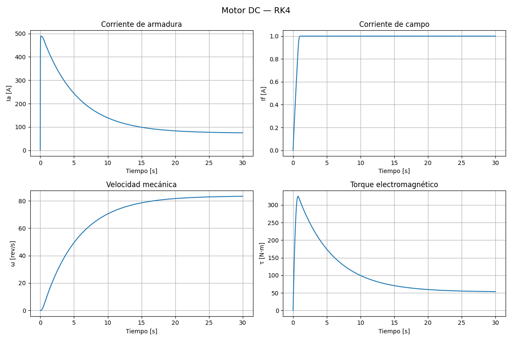
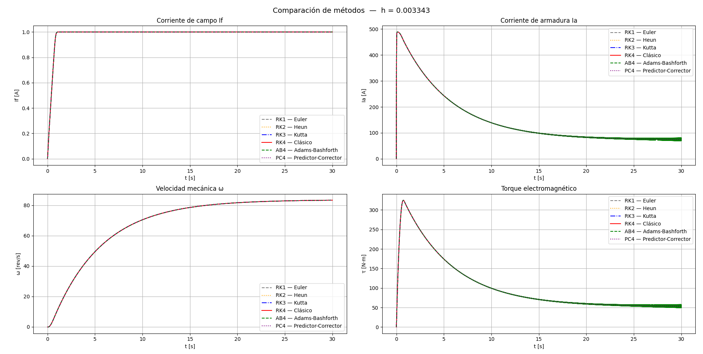
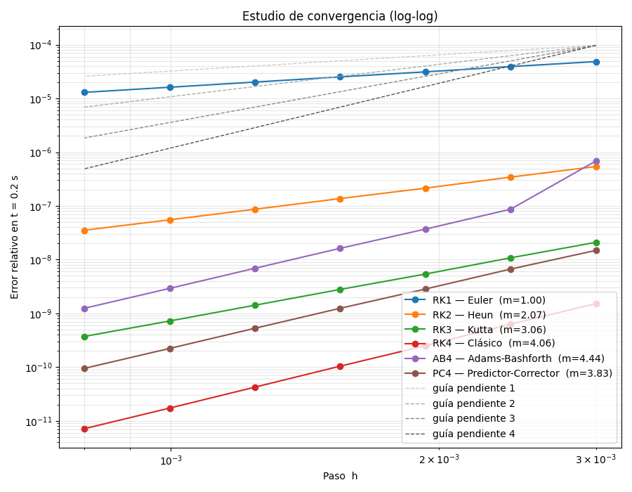

# ode_solver


Librería en Python para resolver sistemas de ecuaciones diferenciales
ordinarias (EDOs) mediante métodos de **Runge-Kutta** (órdenes 1 a 4) y
métodos **multipaso** (Adams-Bashforth y Predictor-Corrector). Como caso de
estudio se modela un **motor DC con excitación independiente y saturación
magnética**, y se comparan todos los métodos sobre el mismo sistema físico.

---

## Objetivo del trabajo

1. Implementar Runge-Kutta de órdenes 1, 2, 3 y 4, y dos métodos multipaso.
2. Aplicarlos al modelo dinámico de un motor DC.
3. Comparar los métodos en dos aspectos independientes: **precisión**
   (orden de convergencia) y **estabilidad** (paso máximo admisible).

---

## El modelo físico

El motor se describe con un sistema de tres EDOs acopladas. El vector de
estado es **y = [If, Ia, ω]** (corriente de campo, corriente de armadura y
velocidad mecánica):

```
dIf/dt = (Vf - Rf·If) / Lf_efectiva
dIa/dt = (Va - Ra·Ia - Kv·Kϕi·If·ω) / La
dω/dt  = (Kt·Kϕi·If·Ia - B·ω - τL) / (J·2π)
```

La **saturación magnética** se modela con una función tangente hiperbólica:
el flujo φ = φmax·tanh(If/Isat) y la inductancia de campo Lf varían con la
corriente, lo que hace el sistema no lineal.

---

## Métodos implementados

| Clave | Método                        | Tipo      | Orden | Evaluaciones de f / paso |
|-------|-------------------------------|-----------|-------|--------------------------|
| `rk1` | Euler explícito               | Un paso   | 1     | 1                        |
| `rk2` | Heun                          | Un paso   | 2     | 2                        |
| `rk3` | Kutta                         | Un paso   | 3     | 3                        |
| `rk4` | Runge-Kutta clásico           | Un paso   | 4     | 4                        |
| `ab4` | Adams-Bashforth 4 pasos       | Multipaso | 4     | 1 (reutiliza historia)   |
| `pc4` | Predictor-Corrector AB4 + AM4 | Multipaso | 4     | 2                        |

Los métodos multipaso generan sus 3 primeros pasos con RK4 (no tienen
historia al arrancar).

---

## Requisitos e instalación

- Python 3.9+, NumPy y Matplotlib.

```
pip install numpy matplotlib
```

---

## Estructura del proyecto

```
ode_solver/
├── integradores/
│   ├── runge_kutta.py    # RK1, RK2, RK3, RK4 (un paso)
│   ├── multipasos.py     # Adams-Bashforth 4 y Predictor-Corrector
│   └── solver.py         # despachador unificado: integrar(...)
├── modelos/
│   └── motor_dc.py       # clase MotorDC
├── utils/
│   ├── graficas.py       # graficar y comparar métodos
│   └── convergencia.py   # estudio de convergencia (log-log)
└── main.py               # punto de entrada
```

---

## Ejecución

Desde la carpeta que contiene a `ode_solver`:

```
python ode_solver/main.py
```

Genera las tres figuras del trabajo: la simulación del motor con RK4, la
comparación temporal de los seis métodos y el estudio de convergencia.

---

## Uso como librería

```python
from modelos.motor_dc import MotorDC

params = {
    'Ra': 0.9, 'La': 0.01, 'Rf': 440, 'J': 3.0, 'B': 0.03,
    'Kv': 40.0, 'Kt': 6.4, 'phi_max': 0.25, 'Isat': 1.25,
    'Lf0': 300.0, 'Lf_min': 30.0, 'Va': 440.0, 'Vf': 440.0, 'tau_L': 50.0
}

motor = MotorDC(**params)
motor.simular(t0=0.0, tf=30.0, h=1e-2, metodo='rk4')
# Resultados: motor.t, motor.If, motor.Ia, motor.w, motor.tau, ...
```

El despachador `integrar(f, t0, tf, y0, h, metodo)` funciona con **cualquier**
EDO, no solo el motor.

---

## Resultados

### Simulación de referencia — RK4 con paso fino



### Comparación de los seis métodos



### Orden de convergencia (escala log-log)



---

## Análisis

**1. Convergencia (precisión).** Se mide el error en escala log-log frente al
paso `h`. La pendiente de cada recta coincide con el orden teórico del método:
RK1 ≈ 1, RK2 ≈ 2, RK3 ≈ 3, y RK4, AB4, PC4 ≈ 4. Esto confirma que los
integradores están bien implementados. La librería se validó además contra la
EDO de solución conocida dy/dt = −2y, recuperando exactamente los órdenes.

**2. Estabilidad.** Los métodos multipaso explícitos tienen una región de
estabilidad **más pequeña** que los Runge-Kutta del mismo orden. Para este
motor, la dinámica rápida es el circuito de armadura (τ = La/Ra ≈ 11 ms), lo
que limita el paso máximo de AB4 a h ≈ 0.0033 s; por encima, AB4 oscila y
diverge, mientras que RK4 y Euler permanecen estables.

---

## Conclusión

El desempeño se separa en dos ejes independientes:

- **Precisión:** a igual paso, RK4 es varios órdenes de magnitud más exacto
  que Euler. Los métodos de orden 4 (RK4, AB4, PC4) son los más precisos.
- **Estabilidad:** el orden no determina la estabilidad. Euler, pese a ser el
  menos preciso, tolera pasos mayores que AB4, que tiene la región de
  estabilidad más estrecha. El corrector de PC4 amplía algo ese margen.

Como el motor es **levemente rígido**, la estabilidad domina la elección
práctica y **RK4 resulta el mejor compromiso**: alto orden y estabilidad
suficiente. AB4/PC4 son más eficientes por paso, pero exigen pasos pequeños
para no inestabilizarse.
